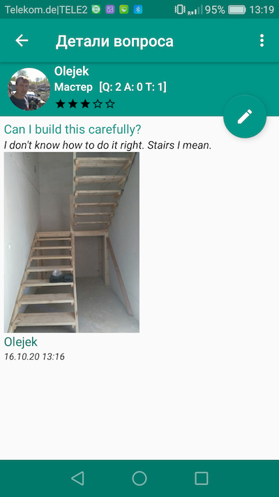

# AskMaster
Ask the Master: Tips, Answers, and Trivia

The program was originally conceived as an operational advisor in the field of construction, household and domestic affairs. For example, if it is not clear how to unscrew the nut or disassemble the device and advice is required. The asker describes the problem, provides photos, and publishes via the app. Wizards or people who simply know how to solve the problem give their answers and recommendations if they wish. you can also post tips on any topic. Users have statistics on all actions, there is a rating system, each answer can be evaluated.

It didn't go further than the implementation of the mobile application, I switched to another idea.
Distributed freely as an example.

